

  

# Volha Khviadchenia

For the last two years I have devoted a lot of time and energy to web development. 💻 At first I studied independently HTML, CSS and Javascript languages. Since September 2020 I began to attend the <a href="https://rs.school/poland/?target=_blank">Rollings Scopes School courses</a> and completed them successfully after 6 months, entering the top 300 students. 🎉 The courses helped me deepen my theoretical understanding of HTML, CSS, and JavaScript, and also hone my practical skills by completing lengthy hands-on exercises. I went ahead and I am currently exploring the React library and the related Redux, Hooks and React Router.

So I'm a junior front-end developer with React. I am looking for a position in Wrocław or remotely. For what concerns employment in Poland, I also have Karta Polaka. Feel free to contact me in case of any queries 🙌

---

### Skills

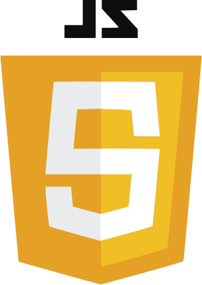

 

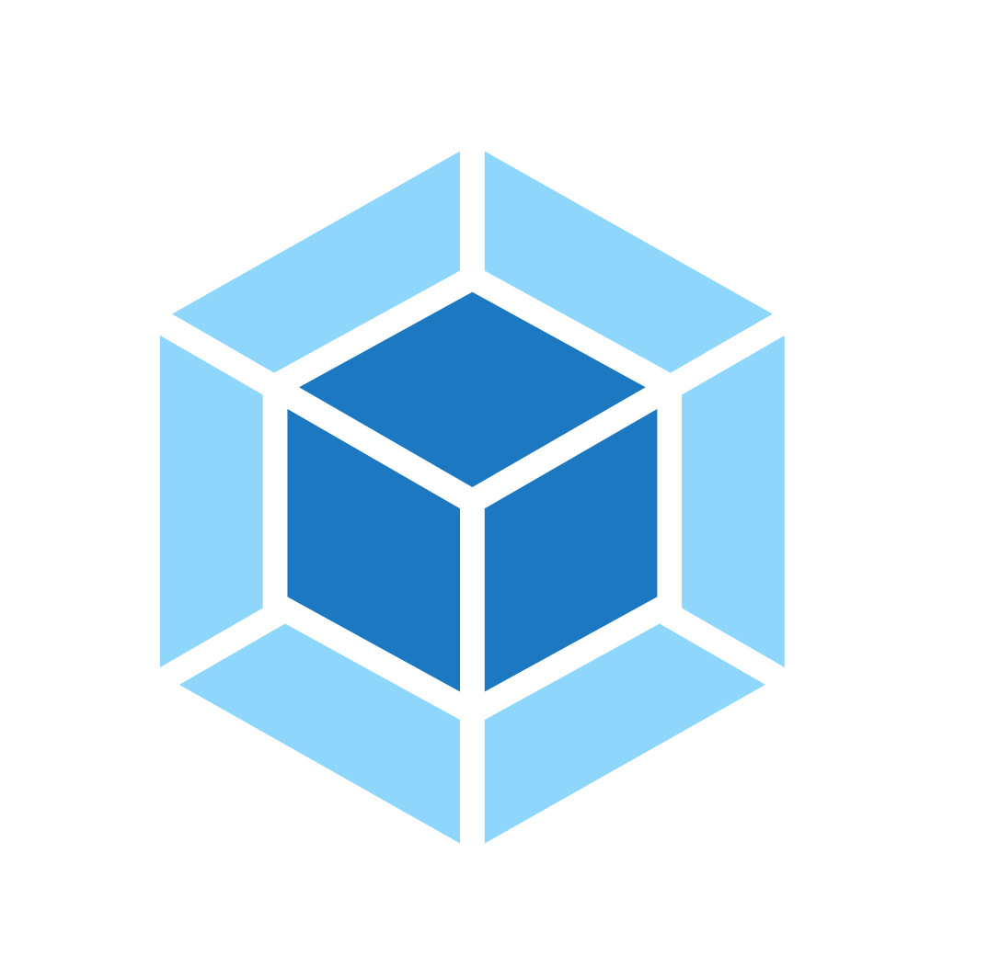

---

### Education

**Web development courses**

- [Rolling Scopes School](https://rs.school/poland/?target=_blank)
  

to see certificate click here

  
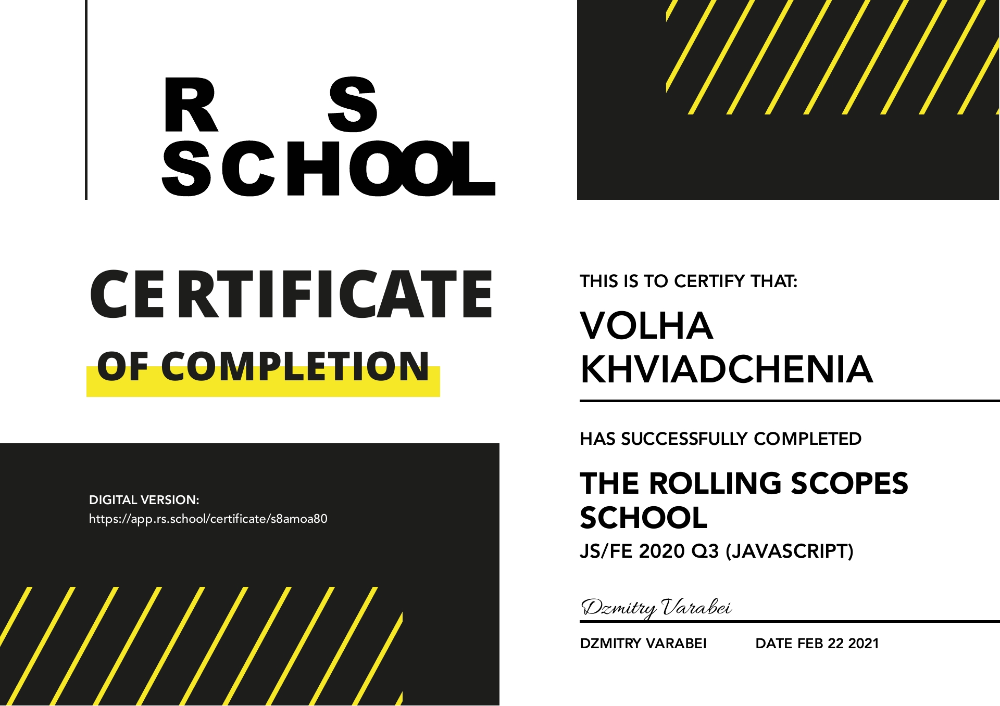

   

- [React - Professional Development](https://www.udemy.com/course/pro-react-redux/?target=_blank) (incl Hooks, React Router, Redux)
- [Computer Science Basics](https://learn.epam.com/detailsPage?id=4b131384-7829-4204-a27b-21c538b41f88)

- Codewars exercises
  
 
    
 statistic is here 

  
<a href="https://www.codewars.com/users/confesssa/stats?target=_blank">
  
  </img>
  </a>

   

**Higher education**

- Brest State Technical University, Enterprise Economy and Management

---

### My projects

<i>At the moment I improve my React skills.</i> 💪

### React apps

<table border="0">
  <tr>
    <th>Project description</th>
    <th width="35%">Preview</th>
  </tr>
  <tr>
    <td>
    
ToDo APP

      

        <strong>Tools: React</strong>
      

      

      Here's a simple todo app implemented with React. The project has the following functions:

      <ul>
        <li>add and delete task records;</li>
        <li>highlight important tasks with a color, crossing out completed tasks;</li>
        <li>search though the tasks;</li>
        <li>three types of filters, to display: all tasks, tasks to be performed and completed tasks;</li>
        <li>an information line that displays the number of uncompleted and completed tasks.</li>
      </ul>
      
You can find the code <a href="https://github.com/confesssa/todo-list">here</a>. Deploy is <a href="https://confesssa.github.io/todo-list/">here</a> or you can click on the image on the right.

    </td>
    <td>
    <a href="https://confesssa.github.io/todo-list/">
      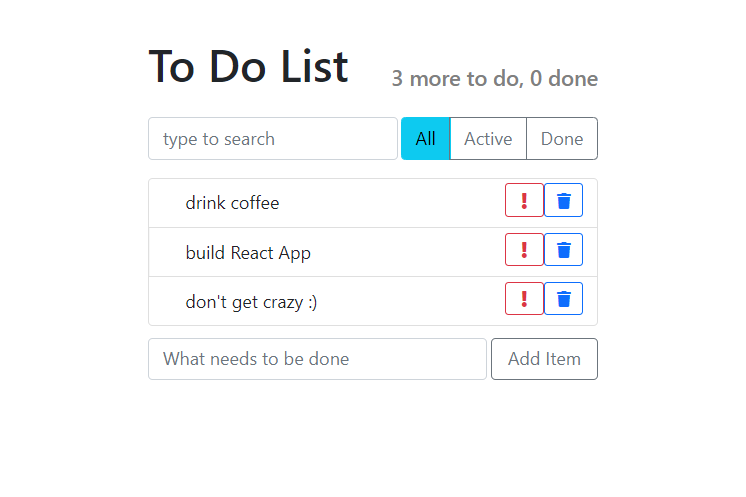
    </a>
</td>
  </tr>
    <tr>
    <td>
    
TIC-TAC-TOE

      

        <strong>Tools: React</strong>
      

      

        This version of the game allows you to:
      

      <ul>
        <li>play tic-tac-toe;</li>
        <li>shows when one of the players has won;</li>
        <li>stores the history of the game;</li>
        <li>allows players to view the history of the game and see past states of the playing field;</li>
      </ul>
      
You can find the code <a href="https://github.com/confesssa/tic-tac-toe">here</a>. Deploy is <a href="https://confesssa.github.io/tic-tac-toe/?target=_blank">here</a> or you can click on the image on the right.

    </td>
    <td>
    <a href="https://confesssa.github.io/tic-tac-toe/">
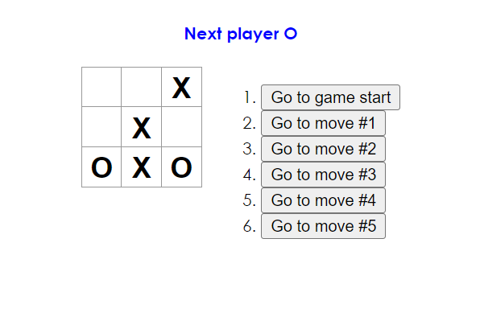</a>
</td>
  </tr>
</table>

### Vanilla JS apps

<table border="0">
  <tr>
    <th>Project description</th>
    <th width="35%">Preview</th>
  </tr>
  <tr>
    <td>
    
Gem puzzle

    
 <strong>Tools: pure HTML/CSS, CSS-Flexbox, CSS-Variables, DocumentFragment</strong>
      

    
Here is the well-known game Gem puzzle or Game of 15. There are 15 tiles on the field, moving which the player should get the picture shown in the sample on the left. When the page is loaded and reset is pressed, the state of the playing field is generated randomly. After the start of the game, a move counter and a timer are activated. The movement of the tiles and the end of the game are accompanied by sounds.

    
The index.html file is empty, all elements are generated via JavaScript. The application is displayed correctly both on desktop and on mobile devices.

      
You can find the code <a href="https://github.com/confesssa/gem-puzzle">here</a>. Deploy is <a href="https://confesssa.github.io/gem-puzzle/">here</a> or you can click on the image on the right.

    </td>
    <td>
      <a href="https://confesssa.github.io/gem-puzzle/">
      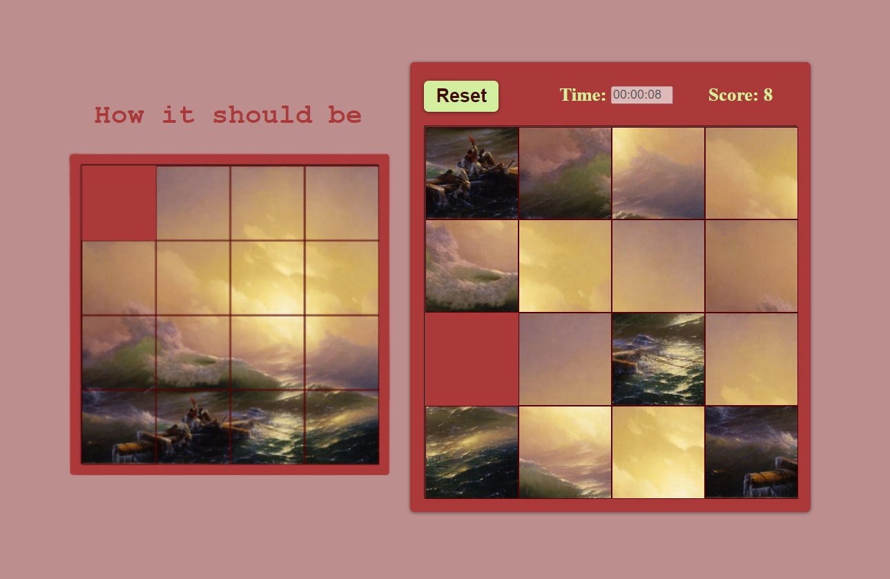</a>
    </td>
  </tr>
    <tr>
    <td>
    
Virtual-keyboard

      

        <strong>Tools: pure HTML/CSS, CSS-Flexbox, CSS-Variables, JS-Classes, JS-Destructuring</strong>
      

      
The index.html file is empty, all elements are generated via JavaScript. The keyboard consists: alphanumeric keys (A-Z, 0-9), constrol keys (Shift, Ctrl, Alt, Caps Lock), Enter and editing keys (Del and Backspase), navigation keys (four arrows). 
      The keyboard responds to keystrokes on both real keyboards and virtual ones (that is with the mouse). In all cases they are accompanied by the animation of a key being pressed.

      
You can find the code <a href="https://github.com/confesssa/virtual-keyboard">here</a>. Deploy is <a href="https://confesssa.github.io/virtual-keyboard/">here</a> or you can click on the image on the right.

    </td>
    <td>
      <a href="https://confesssa.github.io/virtual-keyboard/">
        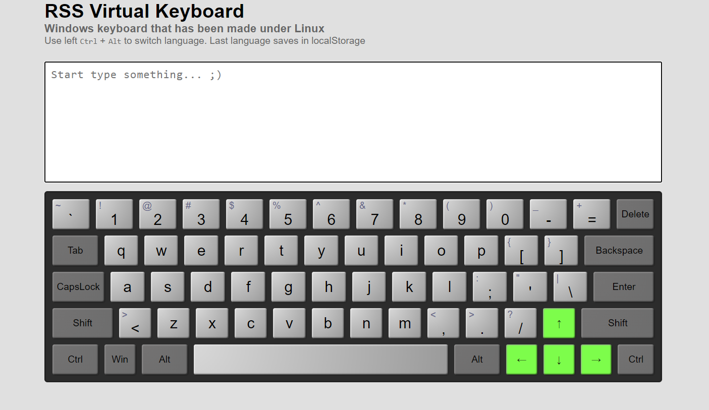
      </a>
    </td>
    </tr>
    <tr>
      <td>
      
JS Calculator

      

        <strong>Tools: vanilla JS, pure HTML/CSS</strong>
      

      
Here is a classic calculator, created using Vanilla JS. It has basic functions (multiplication, division, addition, subtraction), as well as a decimal separator, root extraction (square, cube, and so on), exponentiation, the undoing of the last input and the ability to work with both positive and negative numbers. 

      
You can find the code <a href="https://github.com/confesssa/calculator-JS">here</a>. Deploy is <a href="https://confesssa.github.io/calculator-JS/">here</a> or you can click on the image below.

    </td>
    <td>
      <a href="https://confesssa.github.io/calculator-JS/">
        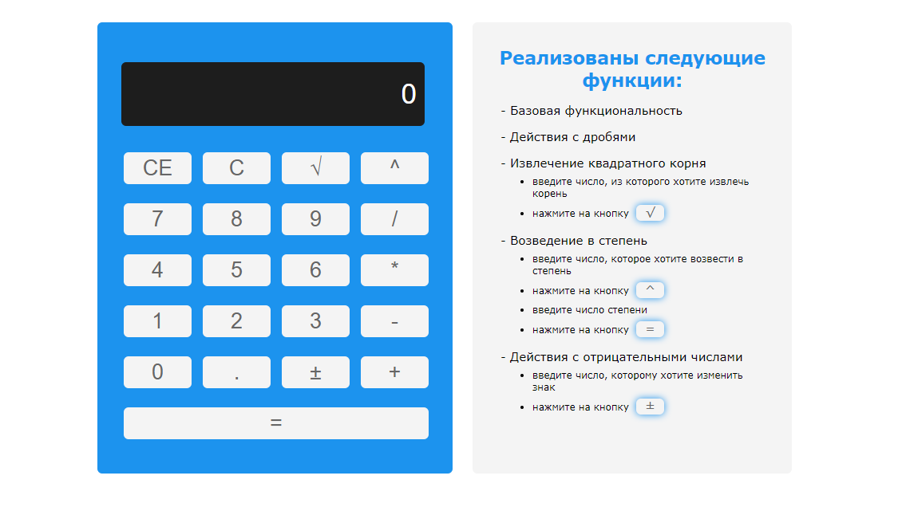
      </a>
    </td>
  </tr>
</table>

### Web-site`s template

<table border="0">
  <tr>
    <th>Project description</th>
    <th width="35%">Preview</th>
  </tr>
  <tr>
    <td>
    
Willberries

    
 <strong>Tools: vanilla JavaScript, Farebase, fetch API, pure HTML/CSS, Bootsrap</strong>
      

    
Here is an example of a marketplace.

    
The main page implements the receipt of data from the network, search and sorting by goods.

    
On the page with product categories you can add and process products in the shopping cart, implemented work with forms, and sending data from the shopping cart to the server.

    
You can find the code <a href="https://github.com/confesssa/wildberries">here</a>. Deploy is <a href="https://confesssa.github.io/wildberries/index.html">here</a> or you can click on the image on the right.

    
<a href="https://www.figma.com/file/wKDy8hlEa1U7lvAzIiBxER/Will-Berries-(Copy)?node-id=0%3A1">Figma layout</a>

    </td>
    <td>
      
    </td>
  </tr>

  <tr>
    <td>
    
Relvise

    
 <strong>Tools: vanilla JavaScript, pure HTML/CSS, BEM-metodology, CSS-Flexbox, CSS-Variables</strong>
      

    
Here is a responsive layout for a finance and consulting company.

    
You can find the code <a href="https://github.com/confesssa/relvise">here</a>. Deploy is <a href="https://confesssa.github.io/Relvise/">here</a> or you can click on the image on the right.

    
<a href="https://www.figma.com/file/ZiKvI8IWyuMf5IhSt9X5oV/Relvise-(Copy)?node-id=964%3A5456">Figma layout</a>

    </td>
    <td>
      
    </td>
  </tr>
    <tr>
    <td>
    
The Landing page about Bootstrap, created using Bootstrap 😆

      

        <strong>Tools: pure HTML/CSS, Bootstrap CSS + JS</strong>
      

      
You can find the code <a href="https://github.com/confesssa/Bootstrap-landing-page">here</a>. Deploy is <a href="https://confesssa.github.io/Bootstrap-landing-page/index.html">here</a> or you can click on the image on the right.

    </td>
    <td>
      <a href="https://confesssa.github.io/Bootstrap-landing-page/index.html">
        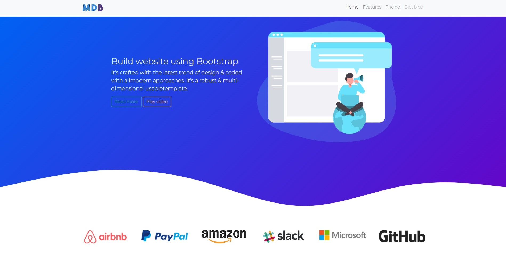
      </a>
    </td>
    </tr>
        <tr>
      <td>
      
Singolo

      

        <strong>Tools: vanilla JS, pure HTML/CSS, Flexbox, CSS-Variables</strong>
      

      
It is a simple landing page.

      
You can find the code <a href="https://github.com/confesssa/singolo">here</a>. Deploy is <a href="https://confesssa.github.io/singolo/">here</a> or you can click on the image below.

      
<a href="https://www.figma.com/file/clXHoPLCjffBg5nL197EiJ/Singolo-(Copy)?node-id=0%3A1">Figma layout</a>

    </td>
    <td>
      <a href="https://confesssa.github.io/singolo/">
        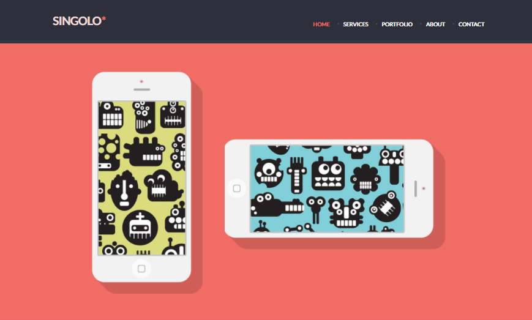
      </a>
    </td>
  </tr>
    <tr>
      <td>
      
Shelter

      

        <strong>Tools: pure HTML/CSS, Flexbox</strong>
      

      
It is a two-page website about an animal shelter in Boston.

      
You can find the code <a href="https://github.com/confesssa/shelter">here</a>. Deploy is <a href="https://confesssa.github.io/shelter/pages/main/main.html">here</a> or you can click on the image below.

      
<a href="https://www.figma.com/file/7vtKQVvagB45XbB8dg4LGP/shelter-dom-(Copy)?node-id=94%3A43">Figma layout</a>

    </td>
    <td>
      <a href="https://confesssa.github.io/shelter/pages/main/main.html">
        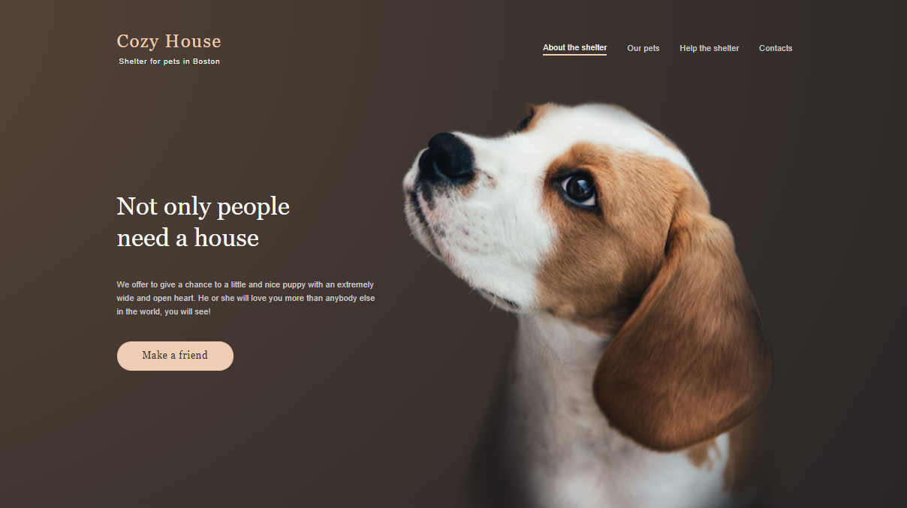
      </a>
    </td>
  </tr>
</table>

### Team-project I took part in

<table border="0">
  <tr>
    <th>Project description</th>
    <th width="35%">Preview</th>
  </tr>
    <tr>
    <td>
      
Clone-Monefy

      
 <strong>Tools: Сhart.js, Bootstrap, Express.js, TypeScript, MongoDB, vanilla JavaScript, pure HTML/CSS, Flexbox</strong>

      
Details of the team's work can be read <a href="https://confesssa.medium.com/%D0%B8%D1%82%D0%BE%D0%B3%D0%BE%D0%B2%D1%8B%D0%B9-%D0%BF%D1%80%D0%BE%D0%B5%D0%BA%D1%82-%D1%81%D1%82%D1%83%D0%B4%D0%B5%D0%BD%D1%82%D0%BE%D0%B2-rolling-scopes-school-%D0%BA%D0%BB%D0%BE%D0%BD-monefy-4402a007b6aa"> in the article on Medium </a>

      
You can find the code <a href="https://github.com/DimaKukhta/rsclone">here</a> or you can click on the image on the right.

    </td>
    <td>
      <a href="https://github.com/DimaKukhta/rsclone">
      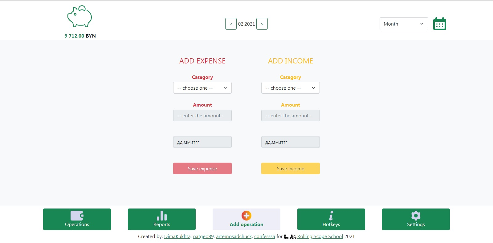</a>
    </td>
  </tr>
  <tr>
    <td>
      
COVID-19

      
 <strong>Tools: REST API, fetch API, vanilla JavaScript, pure HTML/CSS, Flexbox</strong>

      
Application for tracking the spread of COVID-19 in the world and in individual countries. The information is provided in the form of a table, list, graph and interactive map.

      
You can find the code <a href="https://github.com/confesssa/COVID">here</a>. Deploy is <a href="https://confesssa.github.io/COVID/">here</a> or you can click on the image on the right.

    </td>
    <td>
      <a href="https://confesssa.github.io/COVID/">
      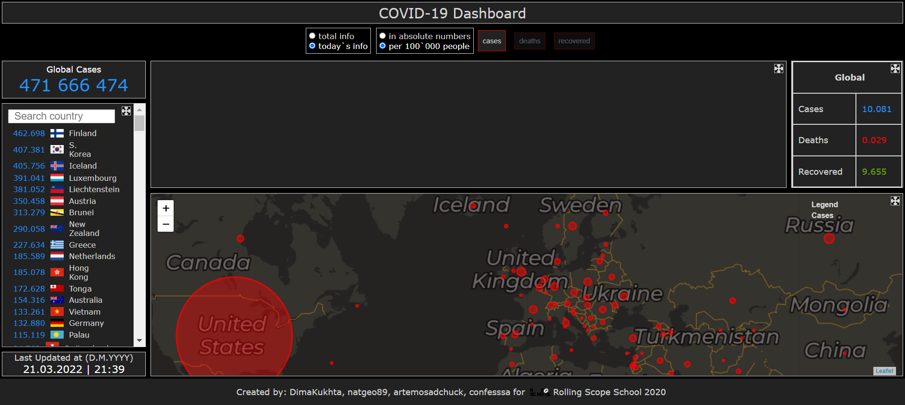</a>
    </td>
  </tr>
</table>

---

<!-- ### My publication -->
<!-- 
There is <a href="https://confesssa.medium.com/%D0%B8%D1%82%D0%BE%D0%B3%D0%BE%D0%B2%D1%8B%D0%B9-%D0%BF%D1%80%D0%BE%D0%B5%D0%BA%D1%82-%D1%81%D1%82%D1%83%D0%B4%D0%B5%D0%BD%D1%82%D0%BE%D0%B2-rolling-scopes-school-%D0%BA%D0%BB%D0%BE%D0%BD-monefy-4402a007b6aa"> an article on Medium </a>about our team project Clone-Monefy
 -->

### My GitHub Stats

 
 <b>click here</b> 

&nbsp;

 

 

 <!-- 

 
 <b>My programming Stats</b> 

 <!--START_SECTION:waka-->

<!--END_SECTION:waka-->
 <!-- 
 -->

---

### Contact me 📫

