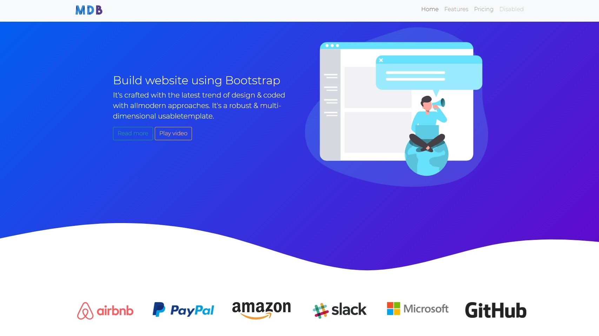

  

## Hi 👋 I'm Volha!

 
 <b>A few words about me 👩</b> 

 
When I was in high school, computer science was one of my favorite subjects. One day, the teacher gave us a task as homework: to create a sample webpage. I remember that night I could not sleep and spent all the time doing my homework, and in the process I had a lot of fun. 😺 Unfortunately after that my life took a different turn, and for a long time my interest were directed to completely different fields.

Now, after more than 10 years, I decided to change the field of activity and try myself as a developer, taking that long-forgotten path which had once appeared in my life. At the moment I am a student at <a href="https://rs.school/js/">RS.School</a>, and I have the ambition of becoming a full-fledged web developer. There is much to do and to learn, but I feel very motivated and ready to face this exciting challenge. 💪

 

## Languages and Tools

 

      

## My projects

<ul>
<li>The first one is the Landing page about Bootstrap, created using Bootstrap. 😆 You can find the code <a href="https://github.com/confesssa/Bootstrap-landing-page">here</a>. Deploy is <a href="https://confesssa.github.io/Bootstrap-landing-page/index.html">here</a> or you can click on the image below.</li>

<li>To be continued..</li>
</ul>

## Some stats

 
 <b>My Codewars Stats</b> 

<a href="https://www.codewars.com/users/confesssa/stats">

</img>
</a>

 

 
 <b>My GitHub Stats</b> 

&nbsp;

 

 <!-- 

 
 <b>My programming Stats</b> 

 <!--START_SECTION:waka-->

<!--END_SECTION:waka-->
 <!-- 
 -->

<!-- ## My publication
<a href="https://confesssa.medium.com/%D0%B8%D1%82%D0%BE%D0%B3%D0%BE%D0%B2%D1%8B%D0%B9-%D0%BF%D1%80%D0%BE%D0%B5%D0%BA%D1%82-%D1%81%D1%82%D1%83%D0%B4%D0%B5%D0%BD%D1%82%D0%BE%D0%B2-rolling-scopes-school-%D0%BA%D0%BB%D0%BE%D0%BD-monefy-4402a007b6aa"> The article on Medium</a> -->

## Contact me

